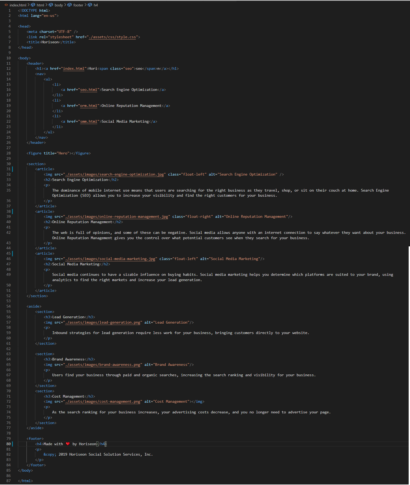
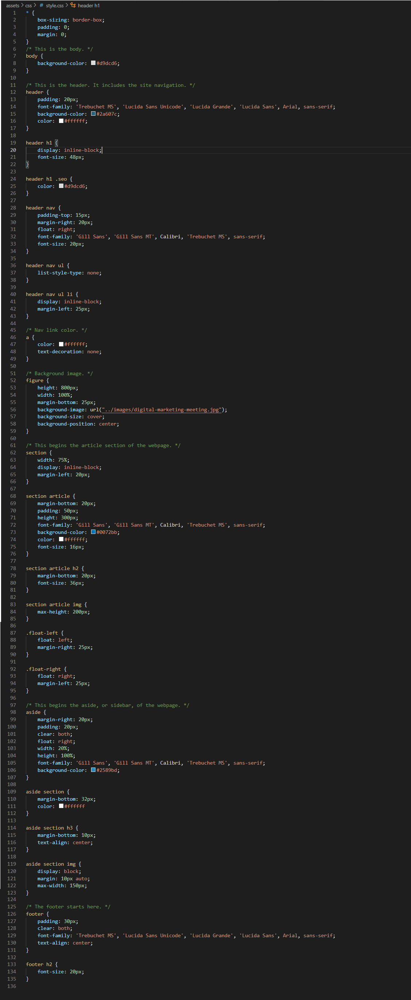

# horiseon-code-refactor

Horiseon Code Refactor

I have edited all of the img tags to add alts so that text readers will be able to read these aloud.

I have added semantic HTML elements to the page by removing the old div classes and changing them to Header, Nav, Article, Aside, and Footer. I have also consolidated some of the identical div classes in css so that they fall under the semantic HTML elements.

I have also made the Horiseon logo in the top left function as a Home link.  I have created filler html docs for the Nav links so I can check their functionality. I added the Nav element to those pages and linked to the CSS file so the Nav links function correctly.  I made a short link.css file to style the nav link pages I created to test link functions.

<strong>Screenshots</strong>
 
Horiseon Webpage Screenshot

HTML Screenshot
 

 
CSS Screenshot
 

